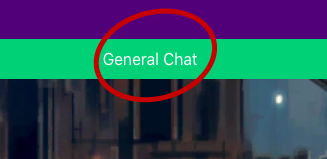

# CSE 183_PROJECT_EMU MATCH

## Introduction
Thanks to stuff like emulators there are a lot of games people play that have online play but only through private room codes. This means there's no matchmaking and it'll be hard to find others to play with. The idea is that this website solves this, allowing people to "queue up" for these games and find others trying to play, then providing some kind of chat space for player to chat with each other.
### Matchingmaking
First is the actual matchmaking. Users, after signing up, can go to the "Games" section and queue up for a game. Here they will be taken to a waiting screen until a match is made. From there, users will be taken to a chatroom where they can discuss everything needed to get the match started. 
### Community
Second is the community feature. Users can join a global chat to discuss any topics that they are interested in and communicate with other users that also in the global chat.

## Group Members

|Name|Email|Project  
Rohan Venkatapuram|rnvenkat@ucsc.edu|EMU MATCH  
Martin Perina|mperina@ucsc.edu|EMU MATCH  
Parmesan|pshah6@ucsc.edu|EMU MATCH  
Jiyu Dong|jdong36@ucsc.edu|EMU MATCH  
Xujun Xie|xxie36@ucsc.edu|EMU MATCH  

## Feature

### Main Page: 
 

At any time, users can return to the main page by clicking on the logo situated in the top-left corner of the webpage.
 
    
 

### Global Chat: 
 

Users have the ability to participate in a global chat and converse with other users in the same chat, irrespective of the game they are playing.
 
    
 

### Game Room: 
 

By clicking on the 'Game' button located at the top of the toolbar, or by simply clicking 'Let's Join the game' at the bottom of the page, users can access the game room.
 
    
 
    
 

### Game Creation: 
 

Within the game room, if users can't find the game they're looking for, they have the option to create their own game by simply clicking the 'Add game' button.
 
    
 

### Joining and Leaving Game Queue: 
 

Users can join the queue for a desired game by clicking the 'Join queue' button in the overview table.
 
    
 

OR by clicking the start button on the game.
 
    
 

Users also have the freedom to leave the queue at any time by clicking the 'Leave queue' button.
 
    
 

### Lobby Chat:
 

After being paired with other users, they can interact with each other via the lobby chat. Users can also exit the lobby by hitting the 'Report Loss' button at the bottom of the lobby chat page.
 
    
Users can also exit the lobby by hitting the 'Report Loss' button at the bottom of the lobby chat page.
 
    